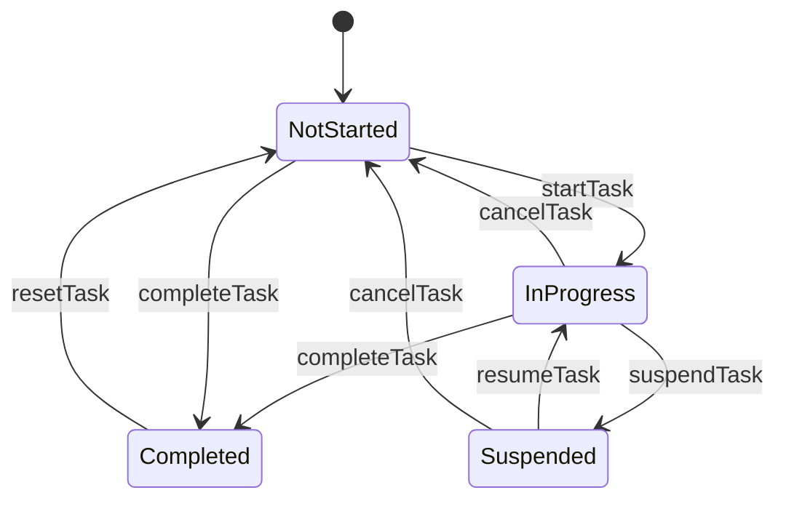

```mermaid
stateDiagram-v2
    [*] --> NotStarted
    NotStarted --> InProgress : startTask
    InProgress --> Completed : completeTask
    InProgress --> Suspended : suspendTask
    InProgress --> NotStarted : cancelTask
    Suspended --> InProgress : resumeTask
    Completed --> NotStarted : resetTask
    Suspended --> NotStarted : cancelTask
    NotStarted --> Completed : completeTask
```